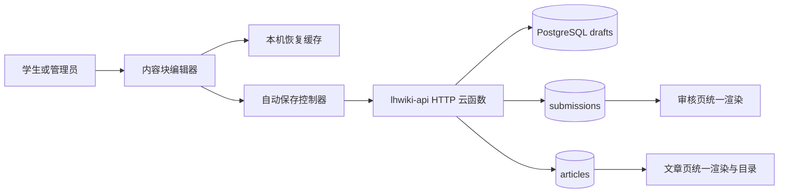
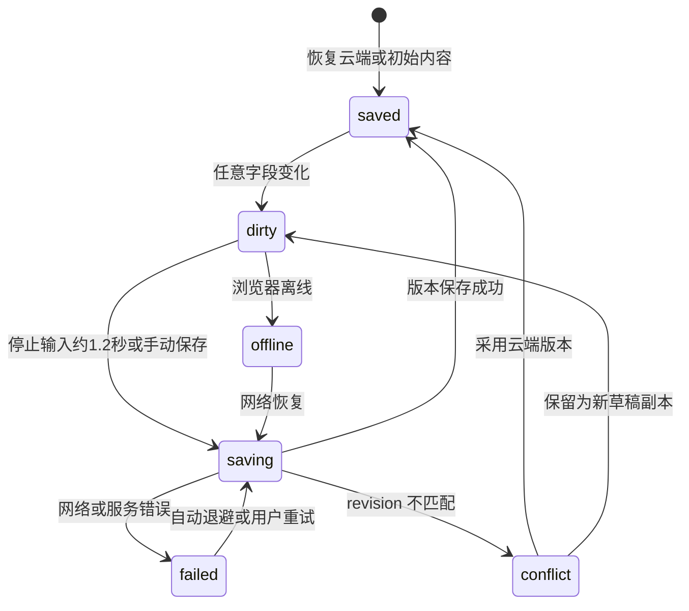

# LHwiki 内容输入体验重构：技术设计

状态：第二阶段实现完成，待生产验收
对应需求：[requirements.md](./requirements.md)

## 1. 总体方案

保留现有“静态 Web + `lhwiki-api` HTTP 云函数 + CloudBase PostgreSQL”架构，不引入浏览器直连数据库，也不增加境外 CDN 或大型编辑器运行时。

本次将旧的单一 `contenteditable` 改为轻量内容块编辑器，并新增独立云端草稿域。编辑页、审核页和文章页共用同一内容模型；发布页根据标题块生成文章子目录。

### 1.1 第二阶段扩展

内容树仍以 JSON 存入现有 `body_json`，不新增数据库表、接口或自动保存请求。根节点允许简单块、表格、分栏与折叠标题；容器只允许一层非容器子块。编辑器保留 `BlockEditor` 与 `DraftManager` 的公开接口，普通输入不触发渲染，Enter 只插入相邻 DOM，表格操作只替换表格块。公式由小型严格解析器建立 MathML DOM，所有用户内容仍只通过 `textContent` 写入。

命令面板是唯一功能发现入口：顶部按钮用于主动探索，活动块旁按钮用于上下文操作，`/` 用于键盘流。面板按文字、结构、数学与块操作分类并支持中英文搜索。390px 窄屏下分栏改为单列，表格滚动被限制在自身容器中。



## 2. 模块边界

### 2.1 `public/editor.js`

负责纯前端内容块编辑行为：

- 内容块创建、删除、拆分、合并和聚焦。
- 块类型切换：`paragraph`、`heading`、`subheading`、`quote`、`bullet`、`number`。
- 工具栏、斜杠菜单、行首快捷转换和键盘导航。
- 纯文本粘贴与多行拆块。
- DOM 与结构化块数组的双向转换。
- 字数、块数、当前块类型及编辑器变化事件。

该模块不负责网络请求、投稿业务或页面路由。

### 2.2 `public/draft-manager.js`

负责草稿状态机：

- 本机恢复缓存写入、读取、清除与过期清理。
- 1.2 秒防抖、串行保存队列、失败指数退避。
- `revision` 乐观并发控制。
- 在线/离线、页面可见性、离开页面和跨标签页通知。
- 保存状态事件：`dirty`、`saving`、`saved`、`offline`、`failed`、`conflict`。

该模块不操作编辑器 DOM，只接收和返回普通 JSON 快照。

### 2.3 `public/app.js`

继续负责路由和页面组合，并改造以下页面：

- 投稿页：装配元数据表单、内容块编辑器、保存状态栏和投稿预览。
- 我的投稿：分别显示“草稿”和“已提交”，支持继续与删除。
- 管理员文章编辑：以 `target_type=article` 建立云草稿。
- 审核页与文章页：调用统一安全渲染器。
- 文章页：使用渲染器产出的标题元数据生成目录。

### 2.4 内容解析层

- `shared/content.js`：本地测试与 Worker 兼容逻辑。
- `cloudbase/functions/lhwiki-api/content.cjs`：云函数运行副本。
- 两者使用相同类型白名单和规范化规则，并以契约测试防止漂移。

## 3. 内容数据模型

### 3.1 块结构

```json
{
  "id": "b_7f832d0b",
  "type": "heading",
  "text": "高三上学期：先建立自己的节奏"
}
```

- `id`：客户端生成的稳定、不含隐私的块标识；只允许字母、数字、下划线和连字符，长度 6—64。
- `type`：仅允许六种文本结构类型。
- `text`：纯文本；保存前规范化换行，服务端限制单块最大长度。
- `heading` 表示二级标题，兼容历史数据；`subheading` 表示三级标题。
- 历史块缺少 `id` 时，读取端生成仅用于当前文档会话的稳定派生标识；下次保存后写回正式标识。

不保存 DOM、HTML、CSS 类名或浏览器命令结果，因此编辑、审核和发布不会因浏览器差异改变结构。

### 3.2 草稿表

新增迁移 `cloudbase/migrations/<timestamp>_add_drafts.sql`：

```sql
CREATE TABLE IF NOT EXISTS public.drafts (
  id text PRIMARY KEY,
  student_id text NOT NULL REFERENCES public.users(student_id) ON DELETE CASCADE,
  draft_key text NOT NULL,
  target_type text NOT NULL CHECK (target_type IN ('new', 'submission', 'article')),
  target_id text,
  section_slug text NOT NULL DEFAULT '',
  title text NOT NULL DEFAULT '',
  summary text NOT NULL DEFAULT '',
  body_json text NOT NULL DEFAULT '[]',
  content_type text NOT NULL DEFAULT '',
  subject text NOT NULL DEFAULT '',
  author_label text NOT NULL DEFAULT '',
  anonymous integer NOT NULL DEFAULT 0 CHECK (anonymous IN (0, 1)),
  revision integer NOT NULL DEFAULT 1 CHECK (revision >= 1),
  created_at timestamptz NOT NULL DEFAULT now(),
  updated_at timestamptz NOT NULL DEFAULT now(),
  UNIQUE (student_id, draft_key)
);
CREATE INDEX IF NOT EXISTS drafts_student_updated_idx
  ON public.drafts (student_id, updated_at DESC);
```

与现有表一致启用并强制 RLS；浏览器无数据库凭据，所有访问经服务端 `service_role`，服务端仍必须做身份归属检查。

`draft_key` 规则：

- 新投稿：`new:<UUID>`。
- 修改投稿：`submission:<submission_id>`。
- 管理员文章：`article:<slug>`。

同一账号对同一目标只存在一份主草稿，防止重复入口造成误覆盖。

## 4. API 设计

### 4.1 获取自己的草稿

`GET /api/drafts/mine`

返回当前账号的完整草稿，按 `updated_at` 降序。普通账号永远看不到其他账号草稿。

### 4.2 创建草稿

`POST /api/drafts`

请求：

```json
{
  "draftKey": "new:客户端UUID",
  "targetType": "new",
  "targetId": null,
  "snapshot": { "title": "", "body": [] }
}
```

服务端校验目标权限并返回 `id`、`revision=1`、`updatedAt`。只有出现首次有效修改时才创建，避免产生大量空草稿。

### 4.3 条件保存

`PUT /api/drafts/:id`

请求包含 `expectedRevision` 和完整快照。服务端通过 PostgreSQL 条件 `PATCH` 同时匹配：

- `id`
- `student_id`
- `revision=expectedRevision`

成功时将 `revision` 原子递增并返回新版本；零行更新时重新读取元数据并返回 HTTP 409。客户端不得自动强制覆盖。

### 4.4 删除草稿

`DELETE /api/drafts/:id`

服务端必须同时按 `id` 与当前 `student_id` 删除。客户端二次确认后调用，并清除对应本机缓存。

### 4.5 从草稿提交

`POST /api/drafts/:id/submit`

1. 校验会话、归属、`expectedRevision` 和完整投稿规则。
2. 根据 `target_type` 执行：
   - `new`：使用草稿 ID 作为投稿 ID，创建投稿；重试天然幂等。
   - `submission`：校验本人所有且状态为 `pending` 或 `changes_requested`，更新并重新进入审核。
   - `article`：仅管理员可更新目标文章，保留 slug。
3. 目标写入成功后删除草稿。
4. 若删除失败，目标写入仍可通过固定 ID 幂等识别；重试只完成清理，不重复生成稿件。

该顺序保证失败时不会先删草稿再丢内容。贡献者登记逻辑仍在正式投稿/审核通过路径执行，不因草稿保存提前上榜。

## 5. PostgreSQL 访问层改造

在 `pg-store.cjs` 增加：

- `createDocument(table, data)`：`POST`，冲突时明确报错。
- `updateDocuments(table, filters, patch, returnRepresentation)`：条件 `PATCH`。
- `deleteDocuments(table, filters)`：多条件安全删除。
- `queryDocuments` 支持排序、字段选择和多种过滤操作，但表名继续走白名单。

将 `drafts` 加入主键白名单。服务端不接收来自客户端的表名、过滤表达式或 `prefer` 头，避免把 PostgREST 能力暴露成任意数据库接口。

## 6. 编辑器交互设计

### 6.1 页面构成

桌面端使用 12 列非对称编辑布局：

- 主写作区占 8 列，标题和摘要直接融入纸面，不嵌套厚重卡片。
- 右侧 3 列为粘性状态栏，显示保存状态、字数、预览和投稿动作。
- 元数据收纳为写作区上方紧凑字段，正文保持连续的长纸面感。

移动端变为单列；保存状态固定在正文上方，投稿按钮位于正常文档流中，斜杠菜单不超出视口。

### 6.2 单块行为

- 每块是一个带 `data-block-id` 与 `data-block-type` 的独立纯文本编辑面。
- Enter 在选区处拆块；Shift+Enter 在当前块插入换行。
- 空块 Backspace：非正文块先退回正文，再次按键才与前块合并。
- Delete 位于块尾时与下一块合并。
- 上/下方向键在边界时切换相邻块，保持尽可能接近的光标列。
- 粘贴多行时，首行进入当前块，其余非空行创建后续正文块；不接收图片或 HTML。
- 输入 `/` 打开紧邻当前块的命令菜单；输入行首快捷前缀后按空格完成转换。

### 6.3 工具和图标

使用内联、同源的 Heroicons 风格 SVG，不加载第三方图标脚本，不使用 emoji 作为功能图标。工具按钮同时提供中文文字或可访问名称。

## 7. 自动保存状态机



实现细节：

- 每次变化先写本机恢复缓存，再标记 `dirtySequence`。
- 同一草稿同时只允许一个云端请求；保存期间产生的新变化在请求结束后继续排队。
- 自动重试采用约 2s、5s、15s、30s 上限退避；用户继续输入不受影响。
- `BroadcastChannel` 通知同源其他标签当前草稿已更新，减少冲突；服务端 revision 仍是最终裁决。
- 本机缓存键按登录账号与 `draft_key` 隔离；登出清理该账号缓存，避免共享电脑残留。
- `visibilitychange`/`pagehide` 触发最后一次尽力保存；未完成时本机缓存仍可恢复。

## 8. 冲突处理

收到 409 后暂停该草稿自动覆盖，显示不遮挡正文的冲突面板：

- “查看云端版本”：在预览区展示云端更新时间和摘要。
- “采用云端版本”：替换当前编辑内容，先将本机版本复制为临时恢复快照。
- “保留我的版本为新草稿”：创建新的 `new:<UUID>` 草稿，不覆盖云端原稿。

首版不做逐字合并，避免错误自动合并比明确选择造成更大内容损失。

## 9. 安全渲染与文章目录

### 9.1 统一渲染

`renderBlocks(container, blocks, options)` 仅使用 `document.createElement` 和 `textContent`：

- `heading` -> `h2`
- `subheading` -> `h3`
- `quote` -> `blockquote`
- 连续 `bullet`/`number` -> 对应列表
- 其他合法块 -> `p`

审核页、投稿预览、文章页都调用这一函数。未知类型降级为段落，绝不拼接用户 HTML。

### 9.2 锚点生成

标题锚点优先使用块 ID：`section-<block-id>`；历史块使用“顺序 + 标题规范化片段”的页面内稳定 ID。通过页面内集合消除同名冲突。

渲染器返回：

```json
[
  { "id": "section-b_7f832d0b", "level": 2, "text": "高三上学期" },
  { "id": "section-b_14ca0932", "level": 3, "text": "适合自己的时间表" }
]
```

文章页据此生成目录。桌面端用 `IntersectionObserver` 更新当前项；移动端使用原生 `details/summary` 折叠。普通 `<a href="#section-id">` 保证无增强时仍可跳转，并遵守 `prefers-reduced-motion`。

## 10. 视觉规范

- 目的：为高中生提供低压力、可长期书写的经验记录环境；视觉反馈应让用户相信内容始终被保存。
- 美学方向：Editorial / magazine，表现为校园刊物的纸面秩序与轻量数字工具，而非后台表单。
- 色板：纸张 `#F5F1E9`、浅纸 `#FFFDF8`、墨色 `#252729`、砖红 `#7E352D`、深青灰 `#283C45`；沿用既有 LHwiki 品牌色，明确覆盖通用 UI 模板偏好。
- 字体：正文与文章标题使用 `Songti SC`、`STSong`、`SimSun`；控件使用 `PingFang SC`、`Microsoft YaHei`。不新增外部字体请求。
- 布局：编辑页为 8+3 列非对称写作台；文章页保留正文宽列和右侧目录窄列。状态条通过细线、文字和小型同源 SVG 表达，不使用大面积阴影或居中卡片堆叠。
- 动效：只在保存状态切换、斜杠菜单出现和目录当前项变化时使用 120—180ms 的 CSS 过渡；尊重减少动画偏好。

## 11. 测试策略

### 11.1 单元与契约测试

- 内容块清洗：合法类型、三级标题、稳定 ID、空块、超长块和恶意字段。
- DOM 无关编辑算法：拆分、合并、快捷转换、纯文本粘贴。
- 草稿状态机：防抖、串行、离线、重试、保存期间再次修改、409 冲突。
- 前端与云函数内容类型白名单一致。
- 文章目录：层级、同名标题、历史无 ID 标题。

### 11.2 API 测试

- 未登录、越权 ID、目标类型越权、非法版本、请求过大和频率限制。
- 创建、恢复、条件保存、冲突、删除和幂等提交。
- 修改投稿和管理员修改文章的状态约束。

### 11.3 端到端回归

按需求文档第 6 节执行真实登录、编辑、刷新、断网模拟、投稿、审核、发布、目录与管理员编辑流程。部署后重新读取数据库记录，确认 `body_json` 类型和 ID 未在各阶段丢失。

## 12. 部署与回滚

1. 部署前执行现有备份并校验摘要。
2. 先应用可向后兼容的 `drafts` 表迁移；旧前端与旧云函数不访问该表，因此安全。
3. 部署云函数并测试新 API；旧投稿 API 保留作为兼容入口。
4. 最后部署静态站点，使新前端开始使用草稿 API。
5. 若前端异常，可回滚静态资源，数据库与云函数保留兼容能力；不得删除已产生草稿。
6. 更新备份脚本，将 `drafts` 纳入导出、摘要和恢复说明。

## 13. 主要取舍

- 不采用 TipTap/ProseMirror：首版格式有限，自研小型纯文本块编辑器能避免大体积依赖、构建链和境外资源，同时更容易保证现有静态架构及大陆访问。
- 不直接存 HTML：牺牲粗体、链接等行内样式，换取可预测保真、安全与长期迁移能力。
- 不做自动冲突合并：明确保留两个版本，避免在长篇观点内容中产生不可察觉的文本损坏。
- 草稿走云函数而非浏览器 PG：复用当前学号会话与权限模型，不暴露数据库服务密钥，也绕开当前 RLS 无客户端策略的限制。
